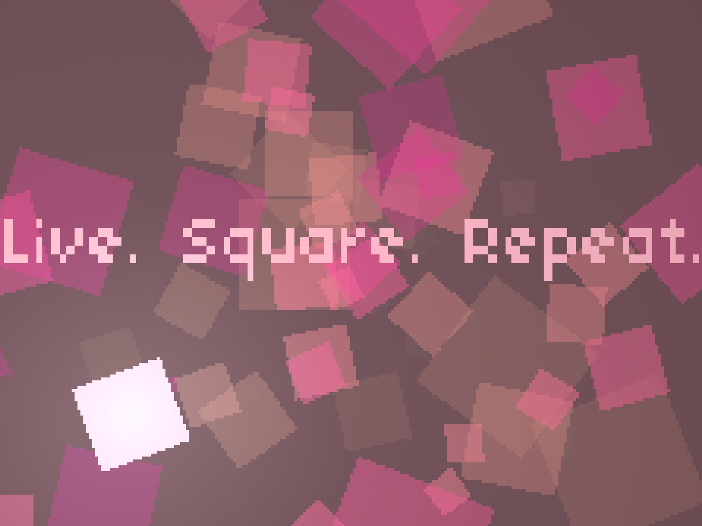
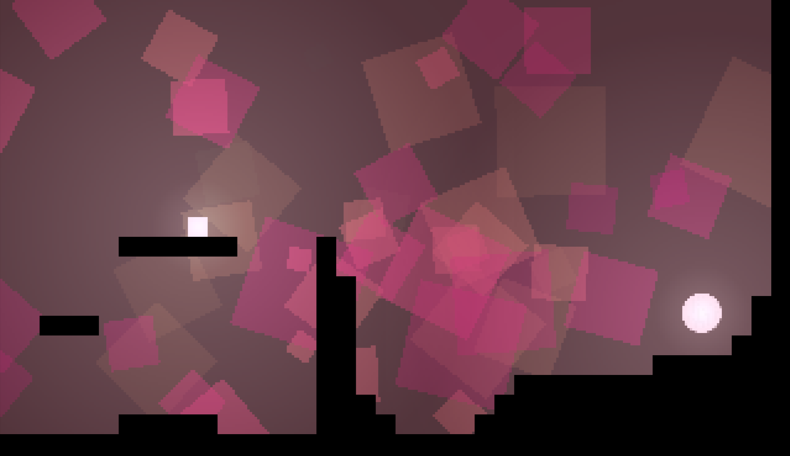
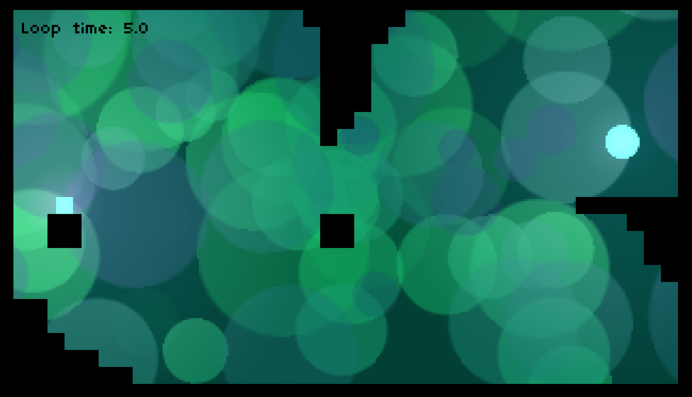
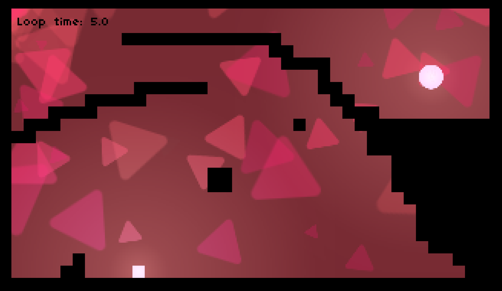

# GMTK Game Jam 2025

## Overview
Live. Square. Repeat was made using Godot 4.4.1 and GDScript for the [GMTK Game Jam 2025](https://itch.io/jam/gmtk-2025). The theme of the game jam was was `LOOP`.  

Live. Square. Repeat eat is a puzzle platformer game. You play as a unassuming square, but there is a catch: you can travel backwards in time, making seemingly impossible situations solvable. 

## Controls

The game is fully controlled using the mouse. 

| Action | Keyboard Input       | Controller Input             |
|--------|----------------------|------------------------------|
| Move   | A and D              | Left analog stick            |
| Jump   | Space                | A (Xbox) or Cross (PS)       |
| Loop   | E                    | X (Xbox) or Square (PS)      |

## Images
  
  
  
  

## Dependencies

The only dependency is the [Godot 4 game engine](https://godotengine.org/). 

## Setup the Project Locally

To setup the project locally, simply clone the repository and open the project in Godot. 

## Inspiration
- [Mt. Major](https://kristoff-red.itch.io/mt-major)

## Asset References
- **DuffsDevice**. Game font. Retrieved from: https://www.pentacom.jp/pentacom/bitfontmaker2/gallery/?id=468
- **Pioter_m**. Piano music. Licence: Attribution 4.0. Retrieved from: https://freesound.org/people/Pioter_m/sounds/717765/
- **Vilkas_Sound**. Jump SFX. Licence: Attribution 4.0. Retrieved from: https://freesound.org/people/Vilkas_Sound/sounds/463388/
- **mehraniiii**. Exit SFX. Licence: Creative Commons 0. Retrieved from: https://freesound.org/people/mehraniiii/sounds/588221/
- **pytho0n11**. Loop SFX. Licence: Creative Commons 0. Retrieved from: https://freesound.org/people/pyth0n11/sounds/706447/
- **wobesound**. Click SFX. Licence: Creative Commons 0. Retrieved from: https://freesound.org/people/wobesound/sounds/488381/
- **Timbre**. Poof SFX. Licence: Attribution NonCommerical 4.0. Retrieved from: https://freesound.org/people/Timbre/sounds/73595/

## Code References
- State Machine: https://youtu.be/ow_Lum-Agbs?si=eszvXZjshpV-3jkt
- Character movement: https://youtu.be/9hCaKstEeps?si=StWC3fxKA2NJSHqJ